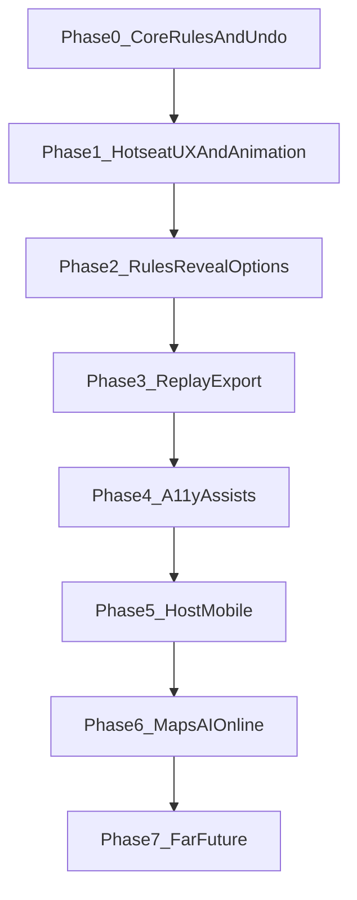

# Roadmap

Suggested execution order derived from [TODOs.md](TODOs.md). Phases keep the game shippable; items inside a phase can interleave.

---

## Phase 0 — Core: correctness, trust, and undo

**Goal:** players never doubt the engine; mistakes are recoverable without corrupting secrecy.

- **Bugs:** Mr. X privacy fade ordering; **2x must increment turn number** (matches rules expectations).
- **2x UI:** **2x button on control panel**
- **Highest-pri rules:** **Mr. X starting ticket count** (board-accurate); **trapped detectives + loss condition**.
- **Undo (core):** allow **undo**, with **wins evaluated only at the end of the detectives’ round** — cross-cutting rules change; ship here alongside trapped + 2x so corner cases are handled once.
- **Tests (minimal but real):** `gameRules` / win detection / turn boundaries; **trivial security** on persistence path if you expose hosting later ([`src/game/persistGameState.ts`](src/game/persistGameState.ts) stays honest).

*Why first:* replay, CPU, and multi-fugitive work stand on stable move + win semantics; undo belongs in the same foundation as those rules.

---

## Phase 1 — Hotseat UX, motion, and daily polish

**Goal:** one shared screen feels fast, readable, and alive.

- **Control panel + layout:** “pop control panel right away,” **see map + controls together** where possible.
- **Navigation:** **jump to station by number**; optional **piece-opacity / legal-move hints** so turns are not guesswork.
- **Settings:** **new game inherits current settings**, **show settings on page**, **intro wording + first-visit-only + on-demand** from menu.
- **Animated transit** (cars / buses / subways / ferries) — ship once Phase 0 move resolution is stable so animation syncs to truth.
- **Small polish:** **favicon and meta** (pairs with any future host).

*Why now:* presentation and map feedback sit on top of a trustworthy core from Phase 0.

---

## Phase 2 — Rules text, schedule, and reveal options

**Goal:** the product matches what players think Scotland Yard is.

- **Rules:** expand prose (multi-page); clarify **multi-fugitive** only when you are ready to **design** it (tickets, 2x, win). Until then, treat multi-fugitive as **experimental / off by default**.
- **Reveal / options:** detective visibility of Mr. X history / full board — keep as **explicit optional** rule (default off).

---

## Phase 3 — History and export

**Goal:** reviewability without breaking secrecy.

- **Replay + export history** (align with “Export state” in lowest-pri — **promote export** if you want shareable postmortems early).

---

## Phase 4 — Accessibility and optional “cheat” assists

**Goal:** inclusive play + practice modes.

- **Keyboard accessibility** (especially fugitive flow on SVG map).
- **Cheat / assist toggles:** possible stations from last known location; **ghost on last known station** — keep behind clear labels so “real” games stay sacred.

---

## Phase 5 — Host and share (before heavy accounts)

**Goal:** a URL people can open.

- **Host** static build; **meta** for link previews.
- **Mobile “works”** (responsive) before **mobile-native feel** — two items in TODOs in that order.
- **User logins** only when you need server-side identity; otherwise defer behind rooms/passwords or magic links.

---

## Phase 6 — Big verticals (pick one spine at a time)

Avoid doing all of these in parallel.

| Spine | Order rationale |
|-------|-----------------|
| **AI** | **CPU Mr. X** first (single hidden actor is simpler), then **CPU detectives**; **multi-fugitive “competitive?”** decides whether AI targets one quarry or many. |
| **Multi-device** | **Rooms, timers**, then **chat/voice** with explicit **visibility rules** (who “hears” what) — depends on hosted infrastructure and probably server-validated moves for trust. |
| **Themed maps** | **Transit modes + skins in config** unlock sci-fi/fantasy without forking core logic. |
| **Custom maps** | **Map tool + validation** — ship after classic play is flawless. |

---

## Phase 7 — Far future / lowest priority

Keep as a bucket: **localization**, **tutorial**, **sound/music**, **dark mode**, **stats**, **string station ids** for exotic labels — nice once the core loop and hosting story are settled.

---

## Dependency sketch

**Hard coupling:** **Multi-fugitive design** (Phase 2) should land before competitive AI and fair CPU detectives (Phase 6).

---

## Far future vs TODOs

Anything you will not touch for 6–12 months can live under **Lowest-pri** in [TODOs.md](TODOs.md) so the top sections stay an honest execution queue.
