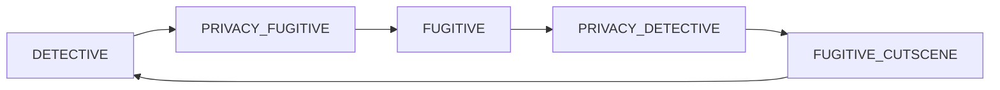

# Game phases and presentation

Macro game flow is split into two layers:

1. **Game phases** (`src/game/phases/`) — pure logic in `GameState.currentTurn.phase`. A phase advances only when its `complete()` method decides exit conditions are met.
2. **Phase actions** (`src/game/phaseActions/`) — async presentation steps (music, markers, modals, move feedback, cutscene beats) driven by `PhaseOrchestrator` when the phase in state changes.

Rules live in [`gameRules.ts`](../src/game/gameRules.ts); the UI applies moves through `commitPlayResult` in [`usePhaseOrchestrator.ts`](../src/hooks/usePhaseOrchestrator.ts), which updates state and runs the orchestrator.

## Macro round order

Each full round follows a fixed cycle (`MACRO_PHASE_CYCLE` in [`Phase.ts`](../src/game/phases/Phase.ts)):



Within **DETECTIVE** and **FUGITIVE**, many players may move before the macro phase completes. Privacy and cutscene steps always run once per round (Mr. X privacy still appears every round after detectives).

| `TurnPhase` | Class | Typical exit |
|-------------|-------|----------------|
| `detective` | `DetectivePhase` | Last detective finished moving or passing |
| `privacy_fugitive` | `FugitivePrivacyPhase` | Player dismisses Mr. X privacy modal |
| `fugitive` | `FugitivePhase` | Last fugitive finished moving or passing |
| `privacy_detective` | `DetectivePrivacyPhase` | Player dismisses detective privacy modal |
| `fugitive_cutscene` | `FugitiveCutscenePhase` | Cutscene action finishes and calls `completeFugitiveCutscene` |
| `game_over` | `GameOverPhase` | Terminal (never advances) |

## Advancing phases

**Only** [`completeCurrentPhase(state)`](../src/game/phases/registry.ts) changes macro-phase in rules code. It delegates to the current phase class:

```ts
const phase = getPhase(state.currentTurn.phase);
return phase.complete(state);
```

`Phase.complete()`:

1. Verifies `state.currentTurn.phase` matches the class.
2. Calls `canComplete(state)` — if false, returns `{ advanced: false }` and unchanged state.
3. Sets `currentTurn.phase` to `nextPhase(state)` and runs `onExit(state)` (e.g. `fugitivePrivacyDismissed` after Mr. X privacy).

When `state.winner !== null`, `completeCurrentPhase` forces `GAME_OVER` regardless of the active phase class.

### Who calls `completeCurrentPhase`

| Call site | When |
|-----------|------|
| `movePlayer` | After a legal move updates `playerOrdinal` (handoff within or out of detective/fugitive round) |
| `passTurn` | After pass updates ordinals and passing lists |
| `clearPrivacy` | Privacy modal dismissed |
| `completeFugitiveCutscene` | Cutscene presentation finished |
| `tryPlayNode` / winner checks | After move, if `getWinner` is non-null |

Gameplay phases (`DetectivePhase`, `FugitivePhase`) share [`PlayerTurnPhase`](../src/game/phases/PlayerTurnPhase.ts):

- **No advance** on double-move part 1 (`doubleMovePart === 1`).
- **No advance** while the next `playerOrdinal` is still a detective or fugitive (same macro step).
- **Advance** when the handoff leaves the round (e.g. last detective → `PRIVACY_FUGITIVE`).

## Phase actions and orchestrator

Each phase class declares three optional action lists:

| Method | Runs when |
|--------|-----------|
| `entryActions()` | Entering the phase (`PhaseOrchestrator.syncToGamePhase`) |
| `postMoveActions()` | Turn handoff after a move/pass in detective or fugitive phase |
| `immediateActions()` | In-turn events (ticket pick, double-start) without changing player |

[`phaseSequences.ts`](../src/game/phaseActions/sequences/phaseSequences.ts) resolves these via `getPhase(turnPhase)` — thin wrappers for the orchestrator.

[`PhaseOrchestrator`](../src/game/phaseActions/PhaseOrchestrator.ts):

- Watches `GameState.currentTurn.phase` (via `usePhaseOrchestrator` effect).
- Runs entry sequences; can **wait** on `player-move` or `privacy-modal`.
- On `handlePlayResult`, runs post-move or immediate actions, then `setState` and re-syncs if the macro phase changed.

Presentation state (`PhasePresentation` in [`types.ts`](../src/game/phaseActions/types.ts)) is separate from `GameState`: music mode, marker visibility, privacy modal, cutscene intro index, interaction lock.

### Example: detective entry

`DetectivePhase.entryActions()`:

1. `SetMusicModeAction("detective")`
2. `ShowPlayerMarkersAction`
3. `AwaitPlayerMoveAction` → orchestrator waits until the next move commits

After a move that hands off to another detective, `postMoveActions()` runs ticket transfer, move feedback (full-screen transport emoji + SFX), then awaits the next move.

## Cutscene (summary)

Round-end cutscene is the `FUGITIVE_CUTSCENE` macro phase. Entry runs `RunFugitiveCutsceneAction`, which sequences `PlayCutsceneMoveBeatAction` per fugitive move and `PlayCutsceneRevealBeatAction` on reveal rounds, then advances via `completeFugitiveCutscene`.

Cutscene transport emoji uses **only** [`FugitiveCutsceneMapOverlay`](../src/game-board/animations/FugitiveCutsceneMapOverlay.tsx), not [`TransportEmojiOverlay`](../src/game-board/animations/TransportEmojiOverlay.tsx) (live turns still use the full-screen overlay).

Details: [`fugitive-cutscene.md`](fugitive-cutscene.md).

## Source layout

| Path | Role |
|------|------|
| [`src/game/phases/`](../src/game/phases/) | Phase classes, `completeCurrentPhase`, `getPhase` |
| [`src/game/phaseFlow.ts`](../src/game/phaseFlow.ts) | Re-exports phase API for older imports |
| [`src/game/phaseActions/`](../src/game/phaseActions/) | `PhaseAction`, runner, orchestrator, action classes |
| [`src/hooks/usePhaseOrchestrator.ts`](../src/hooks/usePhaseOrchestrator.ts) | React hook: presentation state, services, `commitPlayResult` |
| [`src/game/gameRules.ts`](../src/game/gameRules.ts) | Moves, passes, privacy/cutscene completion → `completeCurrentPhase` |
| [`src/game/gameState.ts`](../src/game/gameState.ts) | `TurnPhase` enum and `CurrentTurn` |

## Adding a new macro phase

1. Add a value to `TurnPhase` in `gameState.ts` if needed.
2. Subclass `Phase` (or `PlayerTurnPhase` for multi-player move rounds).
3. Implement `canComplete`, `nextPhase`, and optional `onExit` / action lists.
4. Register the singleton in [`registry.ts`](../src/game/phases/registry.ts).
5. Append to `MACRO_PHASE_CYCLE` if it belongs in the fixed round.
6. Wire any UI dismiss or completion handler to `completeCurrentPhase` (or a thin `gameRules` wrapper).
7. Add tests in [`phases.test.ts`](../src/game/phases/phases.test.ts) and orchestrator/action tests as needed.

## Adding a new presentation step

1. Subclass `PhaseAction` with a stable `id`.
2. Implement `run(ctx)` — use `ctx.patchPresentation`, `ctx.services`, and return `{ status: "continue" }` or `{ status: "wait", kind: "…" }`.
3. Add the action to the relevant phase’s `entryActions`, `postMoveActions`, or `immediateActions`.
4. If it introduces a new wait kind, extend `PhaseWaitKind` and teach `PhaseOrchestrator` how to resume.

## Tests

| Area | File |
|------|------|
| Phase `complete()` and macro cycle | [`phases.test.ts`](../src/game/phases/phases.test.ts), [`phaseFlow.test.ts`](../src/game/phaseFlow.test.ts) |
| Action lists per phase | [`phaseSequences.test.ts`](../src/game/phaseActions/phaseSequences.test.ts) |
| Cutscene beats | [`CutsceneActions.test.ts`](../src/game/phaseActions/actions/CutsceneActions.test.ts) |
| Rules integration (privacy, handoff) | [`gameRules.test.ts`](../src/game/gameRules.test.ts) |
